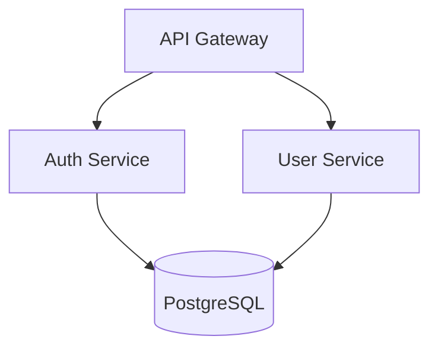

# 🧠 DiagramatIQ

**Aplicación minimalista e inteligente para generar y editar diagramas con ayuda de IA**

Compatible con **Perplexity API** y **Ollama**, orientada a desarrolladores técnicos que necesitan crear diagramas de arquitectura, flujos de trabajo y documentación técnica de forma rápida e inteligente.


## 🚀 Características MVP

- **🔷 Renderizado en tiempo real**: Visualiza diagramas Mermaid, PlantUML y Graphviz al instante
- **📝 Editor inteligente**: Monaco Editor con sintaxis highlighting y autocompletado
- **💬 Chat con IA**: Genera y modifica diagramas usando lenguaje natural
- **🔧 Dual Engine**: Perplexity API (nube) + Ollama (local) para máxima flexibilidad
- **💾 Auto-guardado**: Estado persistente local con exportación múltiple
- **⚡ Live Preview**: Cambios reflejados instantáneamente

## 🛠️ Stack Tecnológico

| Capa | Tecnología |
|------|------------|
| **Frontend** | Next.js 14 + TypeScript + TailwindCSS |
| **Renderizado** | Mermaid.js + Kroki (PlantUML, Graphviz) |
| **Editor** | Monaco Editor (VSCode embebido) |
| **IA** | Perplexity API + Ollama local |
| **Estado** | Zustand + React Query |
| **Almacenamiento** | IndexedDB (Dexie.js) |
| **Contenedores** | Docker + Docker Compose |

## 🏗️ Estructura del Proyecto

```
diagramatiq/
├── 📁 frontend/                    # Next.js app
│   ├── 📁 src/
│   │   ├── 📁 app/                # App Router
│   │   ├── 📁 components/         # Componentes React
│   │   │   ├── 📄 DiagramRenderer.tsx
│   │   │   ├── 📄 CodeEditor.tsx
│   │   │   ├── 📄 AIChat.tsx
│   │   │   └── 📄 Layout.tsx
│   │   ├── 📁 lib/               # Utilidades y configuración
│   │   │   ├── 📄 ai-providers.ts
│   │   │   ├── 📄 diagram-engines.ts
│   │   │   └── 📄 storage.ts
│   │   └── 📁 stores/            # Estado global (Zustand)
│   ├── 📄 package.json
│   ├── 📄 next.config.js
│   └── 📄 tailwind.config.js
├── 📁 backend/                     # FastAPI (opcional para proxy)
│   ├── 📄 main.py
│   ├── 📄 requirements.txt
│   └── 📁 routers/
├── 📄 docker-compose.yml          # Kroki + Ollama + App
├── 📄 README.md
└── 📄 .env.example
```

## 🚦 Quick Start

### 1. Clonar y configurar

```bash
git clone https://github.com/tu-usuario/diagramatiq.git
cd diagramatiq
cp .env.example .env
```

### 2. Configurar variables de entorno

```env
# .env
NEXT_PUBLIC_PERPLEXITY_API_KEY=tu_api_key_aqui
NEXT_PUBLIC_OLLAMA_HOST=http://localhost:11434
NEXT_PUBLIC_KROKI_HOST=http://localhost:8000
```

### 3. Levantar servicios con Docker

```bash
# Inicia Kroki + Ollama + Base de datos
docker-compose up -d

# Instalar dependencias del frontend
cd frontend
npm install

# Iniciar desarrollo
npm run dev
```

### 4. Configurar Ollama (primera vez)

```bash
# Descargar modelo recomendado para diagramas
docker exec -it ollama ollama pull codellama:7b
# o un modelo más pequeño:
docker exec -it ollama ollama pull llama3.2:3b
```

🎉 **¡Listo!** Abre http://localhost:3000

## 📦 Dependencias Principales

### Frontend (`frontend/package.json`)

```json
{
  "dependencies": {
    "next": "^14.0.0",
    "react": "^18.0.0",
    "typescript": "^5.0.0",
    "@monaco-editor/react": "^4.6.0",
    "mermaid": "^10.6.0",
    "zustand": "^4.4.0",
    "@tanstack/react-query": "^5.0.0",
    "dexie": "^3.2.0",
    "tailwindcss": "^3.3.0",
    "lucide-react": "^0.290.0"
  },
  "devDependencies": {
    "@types/node": "^20.0.0",
    "eslint": "^8.0.0",
    "prettier": "^3.0.0"
  }
}
```

### Backend (Opcional - `backend/requirements.txt`)

```txt
fastapi==0.104.1
uvicorn[standard]==0.24.0
httpx==0.25.0
python-dotenv==1.0.0
```

## 💡 Uso Básico

### 1. Crear diagrama con IA

```
💬 Chat: "Crea un diagrama de arquitectura con API Gateway, 2 microservicios y una base de datos PostgreSQL"
```

La IA generará automáticamente código Mermaid como:



### 2. Editar manualmente

Modifica el código directamente en el editor Monaco con autocompletado y syntax highlighting.

### 3. Exportar

- **SVG**: Para documentación
- **PNG**: Para presentaciones  
- **Código**: Para repos de GitHub

## 🔧 Configuración Avanzada

### Perplexity API Setup

1. Obtén tu API key en [perplexity.ai](https://perplexity.ai)
2. Añádela al `.env`:
   ```env
   NEXT_PUBLIC_PERPLEXITY_API_KEY=pplx-xxxxx
   ```

### Ollama Local Setup

```bash
# Modelos recomendados para diagramas
ollama pull codellama:7b      # Mejor para código
ollama pull llama3.2:3b       # Más rápido
ollama pull deepseek-coder:6.7b # Excelente para arquitectura
```

## 🗺️ Roadmap

### 📋 Fase 1 (MVP) - En desarrollo
- [x] Renderizado Mermaid básico
- [ ] Editor Monaco integrado
- [ ] Chat IA básico (Perplexity + Ollama)
- [ ] Auto-guardado local
- [ ] Exportación SVG/PNG

### 📋 Fase 2 - Próximamente
- [ ] Soporte PlantUML y Graphviz
- [ ] Proyectos organizados
- [ ] Historial de versiones
- [ ] Templates pre-configurados

### 📋 Fase 3 - Futuro
- [ ] Colaboración en tiempo real
- [ ] GitHub sync
- [ ] Plugin VSCode
- [ ] API pública

## 🤝 Contribuir

1. Fork el proyecto
2. Crea tu branch (`git checkout -b feature/amazing-feature`)
3. Commit tus cambios (`git commit -m 'Add amazing feature'`)
4. Push al branch (`git push origin feature/amazing-feature`) 
5. Abre un Pull Request

## 📄 Licencia

MIT License - ve [LICENSE](LICENSE) para detalles.

## 🆘 Soporte

- 🐛 **Issues**: [GitHub Issues](https://github.com/tu-usuario/diagramatiq/issues)
- 💬 **Discusiones**: [GitHub Discussions](https://github.com/tu-usuario/diagramatiq/discussions)
- 📧 **Email**: tu-email@ejemplo.com

---

**Hecho con ❤️ para desarrolladores técnicos que aman los diagramas inteligentes**