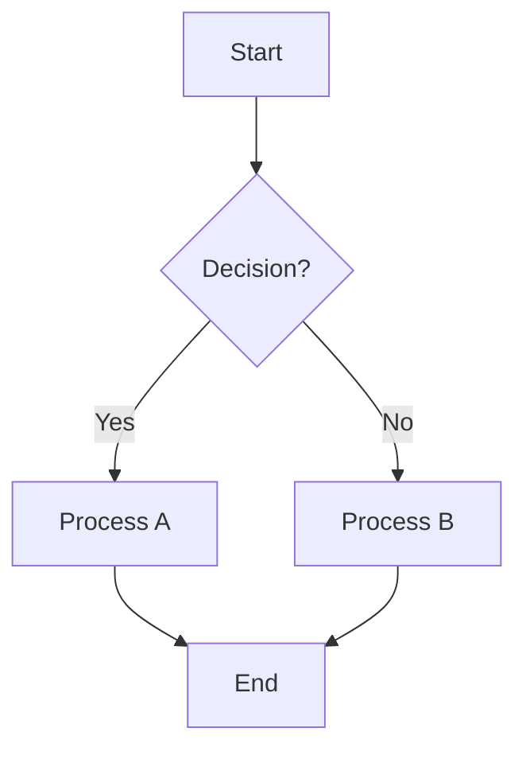
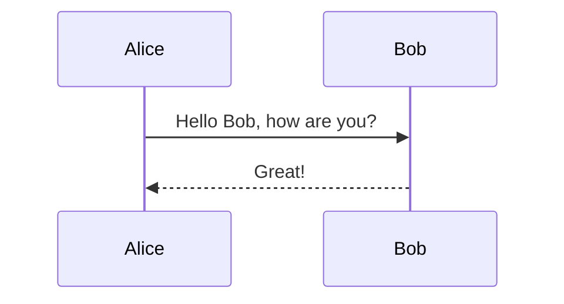
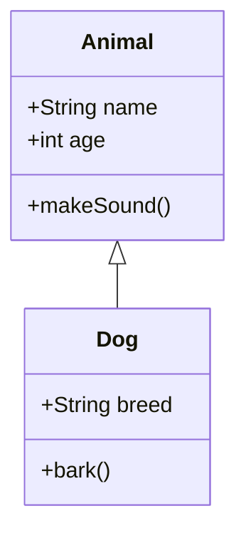

# Mermaid Integration - Technical Documentation

## Overview

DiagramatIQ now supports real-time rendering of Mermaid diagrams with error handling and export capabilities. This document describes the implementation details and architecture decisions.

## Architecture

### Hook-based Approach

The Mermaid integration is built around a custom React hook `useMermaid` that encapsulates all diagram rendering logic:

```typescript
// /src/hooks/useMermaid.ts
export const useMermaid = (options: UseMermaidOptions = {}): UseMermaidReturn
```

### Key Components

1. **useMermaid Hook** (`/src/hooks/useMermaid.ts`)
   - Manages Mermaid initialization and configuration
   - Handles diagram rendering with error catching
   - Provides export functionality (SVG/PNG)
   - Optimizes performance with proper cleanup

2. **DiagramRenderer Component** (`/src/components/diagram/DiagramRenderer.tsx`)
   - Uses the useMermaid hook
   - Displays rendered diagrams or error states
   - Provides export buttons for SVG/PNG
   - Handles different diagram types (Mermaid supported, others planned)

## Implementation Details

### Mermaid Configuration

```typescript
mermaid.initialize({
  startOnLoad: false,
  theme: 'dark',
  securityLevel: 'loose',
  fontFamily: 'ui-monospace, SFMono-Regular, ...',
  darkMode: true,
  themeVariables: {
    primaryColor: '#3b82f6',
    primaryTextColor: '#ffffff',
    background: '#111827',
    // ... custom DiagramatIQ theme
  }
});
```

### Error Handling

The implementation includes comprehensive error handling:

1. **Syntax Validation**: Uses `mermaid.parse()` to validate syntax before rendering
2. **Error Display**: Shows user-friendly error messages in the diagram area
3. **Error Recovery**: Graceful fallback when rendering fails

### Performance Optimizations

1. **Lazy Initialization**: Mermaid is initialized only once
2. **Conditional Rendering**: Only re-renders when code actually changes
3. **Cleanup**: Proper cleanup of DOM elements between renders
4. **Unique IDs**: Generates unique IDs for each diagram to prevent conflicts

### Export Functionality

#### SVG Export
- Direct extraction from rendered SVG element
- Maintains vector format and styling
- Instant download with proper filename

#### PNG Export
- Uses HTML5 Canvas API to convert SVG to PNG
- Adds white background for better visibility
- Maintains diagram quality and proportions

## Usage Examples

### Basic Mermaid Diagram



### Sequence Diagram



### Class Diagram



## Error States

The implementation handles various error scenarios:

1. **Syntax Errors**: Invalid Mermaid syntax
2. **Parse Errors**: Malformed diagram structure
3. **Rendering Errors**: Issues during SVG generation
4. **Export Errors**: Problems during file export

Each error type displays appropriate user feedback with actionable information.

## Future Enhancements

### Planned Features

1. **PlantUML Support**: Integration with Kroki service
2. **Graphviz Support**: DOT language rendering
3. **Custom Themes**: User-selectable color schemes
4. **Advanced Export**: PDF export, custom sizing
5. **Collaboration**: Real-time collaborative editing

### Performance Improvements

1. **Virtualization**: For large diagrams
2. **Caching**: Intelligent diagram caching
3. **Web Workers**: Background rendering for complex diagrams
4. **Streaming**: Progressive rendering for large files

## Testing Strategy

### Unit Tests
- Hook functionality testing
- Error handling validation
- Export functionality verification

### Integration Tests
- Component interaction testing
- End-to-end diagram rendering
- Export workflow validation

### Performance Tests
- Rendering speed benchmarks
- Memory usage monitoring
- Large diagram handling

## Troubleshooting

### Common Issues

1. **Diagram Not Rendering**
   - Check syntax validity
   - Verify Mermaid initialization
   - Check browser console for errors

2. **Export Not Working**
   - Ensure diagram is rendered successfully
   - Check browser download permissions
   - Verify SVG element exists in DOM

3. **Performance Issues**
   - Monitor diagram complexity
   - Check for memory leaks
   - Verify proper cleanup

### Debug Mode

Enable debug logging by setting:
```typescript
// In development
console.log('Mermaid rendering:', { code, error, isLoading });
```

## Browser Compatibility

- **Chrome**: Full support
- **Firefox**: Full support
- **Safari**: Full support
- **Edge**: Full support

### Minimum Requirements
- ES2018 support
- Canvas API support
- Blob API support
- URL.createObjectURL support

## Security Considerations

1. **XSS Prevention**: Mermaid securityLevel set to 'loose' for functionality
2. **Content Sanitization**: User input is processed through Mermaid parser
3. **File Downloads**: Generated files are created client-side only

## Performance Metrics

### Target Performance
- **Rendering Time**: < 500ms for typical diagrams
- **Export Time**: < 2s for SVG, < 5s for PNG
- **Memory Usage**: < 50MB for complex diagrams
- **Bundle Size**: Mermaid adds ~800KB to bundle

### Monitoring
- Render time tracking
- Error rate monitoring
- Export success rates
- User interaction metrics

---

**Last Updated**: December 2024  
**Version**: 1.0.0  
**Status**: Production Ready